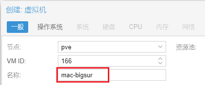
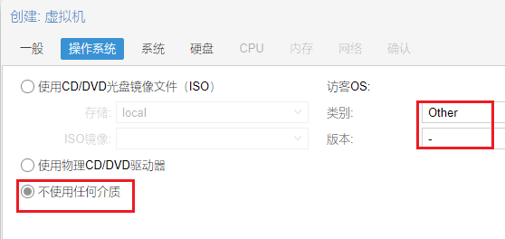
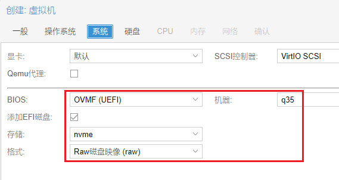
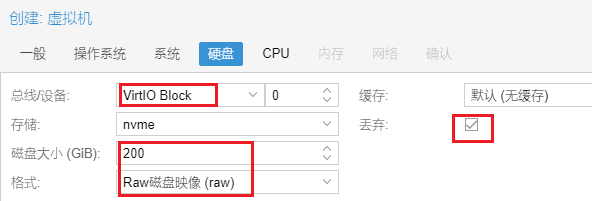
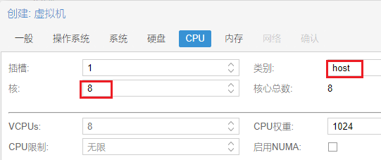
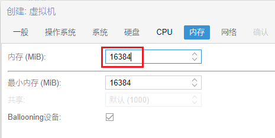
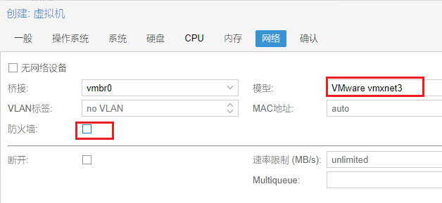
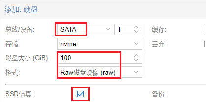
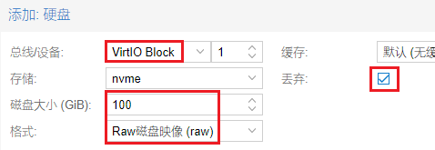

环境：proxmox-6.3.1

Big Sur对比Catalina有比较大的变化，下载的官网镜像转iso肯定是不能安装启动的。


参考资料：

[](https://www.nicksherlock.com/2020/06/installing-macos-big-sur-on-proxmox/)

[](https://azhuge233.com/proxmox-ve-虚拟化-macos-big-sur/)


一、制作iso

假定有1台mac电脑（或者linux也可以，版本ubuntu20.04或以上）

mac需要：

```
xcode-select --install
```

linux需要：

```
sudo apt install g++ git qemu-utils libxml2-dev libssl-dev zlib1g-dev cmake libbz2-dev libfuse-dev fuse autoconf unzip
```

然后下载源码及运行脚本：

```
git clone https://github.com/thenickdude/OSX-KVM.git
cd OSX-KVM/scripts/bigsur
make BigSur-full.img                    # mac下执行
make BigSur-recovery.img                # linux下执行
```

说明：mac生成的是完整版本，linux生成的在安装过程中需要网络下载


二、下载opencore

[](https://github.com/thenickdude/KVM-Opencore/releases)

至少下载OpenCore-v10.iso.gz

然后把2个镜像上传到pve


三、创建虚拟机











四、添加硬盘和光驱

添加ide光驱，选opencore.iso
添加sata光驱，选bigsur.img

